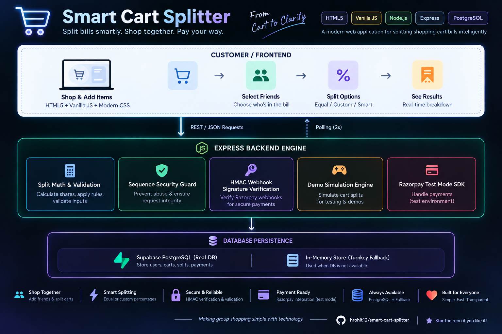

# SMART CART SPLITTER

> **An Intelligent D2C E-Commerce Sequential Checkout & Payment Splitting Engine**  
> Coding Competition Prototype for D2C/E-Commerce Checkout Optimization.

---

## 1. Project Overview

**SMART CART SPLITTER** is an intelligent checkout portal for D2C e-commerce stores designed to break large cart values into compliant, sequential payment installments below configured payment limits (e.g. ₹2,000 threshold), without exposing merchants or payment providers to unverified split transactions.

### Core Value Proposition
- **Automated Installment Calculation**: Automatically determines whether a cart total requires splitting, calculates the minimum number of installments, and distributes the amount evenly to the exact paise.
- **Sequential Payment Security**: Installment $N+1$ unlocks **strictly after** installment $N$ has been verified as `PAID` via webhook or authoritative backend confirmation. The customer cannot tamper with status, URLs, or client-side storage to unlock future payments.
- **Turnkey Dual-Mode (Demo & Live Razorpay)**: Operates seamlessly out of the box in `DEMO_MODE=true` (simulating the entire checkout, QR code, payment gateway, and webhook unlock without real money or API keys), and instantly upgrades to **Razorpay Test Mode** when API credentials are provided.
- **Estimated Savings Engine**: Dynamically displays calculated demo fee savings using a configurable rate (`DEMO_FEE_RATE = 0.004` / 0.40%), clearly labeled as **"Estimated / Demo Savings"**.
- **Merchant Analytics & Instant Invoice**: Comprehensive merchant dashboard tracking split volume, gross processed value, and fee optimization, with downloadable PDF/print invoice generation.

---

## 2. Architecture

<p align="center">
  
</p>

<p align="center">
  <i>Smart Cart Splitter — Frontend, backend, security, payments and database architecture.</i>
</p>

---

## 3. Folder Structure

```
smart-cart-splitter/
├── frontend/
│   ├── index.html            # Main store checkout & split visualizer
│   ├── dashboard.html        # Merchant analytics & savings trend chart
│   ├── order.html            # Order status timeline & sequential tracking
│   ├── demo-payment.html     # Simulated payment gateway for demo mode
│   ├── style.css             # Apple-inspired fintech design system
│   ├── app.js                # Reusable split algorithm, cart & API client
│   └── config.js             # Optional frontend API base URL override
├── backend/
│   ├── server.js             # Express server entry point & static server
│   ├── routes.js             # Core business logic, APIs, and security guards
│   ├── package.json          # Backend dependencies (Express, Razorpay, etc.)
│   └── .env.example          # Backend environment variables template
├── supabase/
│   └── schema.sql            # Full PostgreSQL DDL schema & sample seed data
├── README.md                 # Complete documentation & deployment guide
└── .gitignore                # Git exclusions
```

---

## 4. The Split Algorithm (PAISE-ACCURATE)

Located in `backend/routes.js` and `frontend/app.js`:

```javascript
function calculateSplits(totalAmount, paymentLimit = 2000) {
  const MAX_SPLIT_AMOUNT = 1999;
  const total = Number(totalAmount);

  // Rule 1: Below or equal to limit -> 1 payment
  if (total <= paymentLimit) {
    return [{
      sequence_number: 1,
      amount: Number(total.toFixed(2)),
      amount_paise: Math.round(total * 100),
      status: 'READY'
    }];
  }

  // Rule 2: Strictly below ₹2,000 per installment
  const numberOfSplits = Math.ceil(total / MAX_SPLIT_AMOUNT);
  const totalPaise = Math.round(total * 100);
  const basePaise = Math.floor(totalPaise / numberOfSplits);
  const remainder = totalPaise % numberOfSplits;

  const splits = [];
  for (let i = 0; i < numberOfSplits; i++) {
    // Distribute remainder down to the single paise
    const splitPaise = basePaise + (i < remainder ? 1 : 0);
    splits.push({
      sequence_number: i + 1,
      amount: Number((splitPaise / 100).toFixed(2)),
      amount_paise: splitPaise,
      status: i === 0 ? 'READY' : 'LOCKED'
    });
  }
  return splits;
}
```

### Verified Test Cases
| Cart Total | Number of Splits | Installment Amounts | All Below ₹2,000? |
|---|---|---|---|
| **₹1,500** | 1 payment | ₹1,500.00 | Yes (<= ₹2,000 threshold) |
| **₹2,000** | 1 payment | ₹2,000.00 | Yes (<= ₹2,000 threshold) |
| **₹2,001** | 2 payments | ₹1,000.50, ₹1,000.50 | Yes (< ₹2,000) |
| **₹4,680** | 3 payments | ₹1,560.00, ₹1,560.00, ₹1,560.00 | Yes (< ₹2,000) |
| **₹5,000** | 3 payments | ₹1,666.67, ₹1,666.67, ₹1,666.66 | Yes (< ₹2,000) |
| **₹10,000**| 6 payments | ₹1,666.67 (x4), ₹1,666.66 (x2) | Yes (< ₹2,000) |

---

## 5. Local Setup & Execution

### Prerequisites
- Node.js 18+ installed
- (Optional) Python 3 for running a static frontend server

### Option A: Unified Local Server (Easiest)
Run the backend, which also serves the frontend on port 5000:

```bash
cd backend
npm install
npm start
```
Visit in your browser:  
👉 **http://localhost:5000**

### Option B: Separate Frontend & Backend Servers (Production Simulation)

**Terminal 1 (Backend):**
```bash
cd backend
npm install
npm start
# Backend runs on http://localhost:5000
```

**Terminal 2 (Frontend):**
```bash
cd frontend
python3 -m http.server 5500
# Frontend runs on http://localhost:5500
# app.js automatically routes API calls to http://localhost:5000!
```
Visit in your browser:  
👉 **http://localhost:5500**

---

## 6. Environment Variables

Create `.env` in the `backend/` folder (copied from `backend/.env.example`):

```env
# Operating Mode
DEMO_MODE=true

# Server Configuration
PORT=5000
SERVER_URL=http://localhost:5000
FRONTEND_URL=http://localhost:5500

# Razorpay Test Mode Credentials (Required only when DEMO_MODE=false)
RAZORPAY_KEY_ID=rzp_test_YourKeyIdHere
RAZORPAY_KEY_SECRET=YourSecretKeyHere
RAZORPAY_WEBHOOK_SECRET=YourWebhookSecretHere

# Supabase PostgreSQL Credentials (Optional - built-in memory store fallback included)
SUPABASE_URL=https://your-project.supabase.co
SUPABASE_ANON_KEY=your-anon-key
SUPABASE_SERVICE_ROLE_KEY=your-service-role-key

# Business Rules
PAYMENT_LIMIT=2000
DEMO_FEE_RATE=0.004
```

---

## 7. Supabase Setup

1. Create a new project in [Supabase](https://supabase.com).
2. Navigate to **SQL Editor** in the left navigation.
3. Open `supabase/schema.sql` from this repository.
4. Paste the entire SQL script and click **Run**.
5. Copy your **Project URL** and **Service Role Secret** from **Project Settings -> API**.
6. Set `SUPABASE_URL` and `SUPABASE_SERVICE_ROLE_KEY` in `backend/.env`.

---

## 8. Razorpay Test Mode & Webhook Setup

When ready to test with real Razorpay Test credentials:

1. Log into your [Razorpay Dashboard](https://dashboard.razorpay.com).
2. Switch to **Test Mode** (toggle in upper left).
3. Go to **Settings -> API Keys** and generate a Test Key (`RAZORPAY_KEY_ID`, `RAZORPAY_KEY_SECRET`).
4. Set `DEMO_MODE=false` in `backend/.env`.
5. Under **Settings -> Webhooks**, click **Add New Webhook**:
   - **Webhook URL**: `https://your-backend-domain.com/api/webhooks/razorpay` (or your Ngrok URL during local testing)
   - **Secret**: Enter a secure string and save it to `RAZORPAY_WEBHOOK_SECRET`.
   - **Active Events**: Check `payment_link.paid` and `payment.captured`.
6. Save webhook. All signature verifications run via crypto HMAC-SHA256.

---

## 9. Deployment Guides

### Frontend -> Netlify
1. Go to [Netlify](https://app.netlify.com).
2. Drag and drop the `frontend/` folder directly into the Netlify dashboard, OR link your GitHub repository with:
   - **Base directory**: `frontend`
   - **Publish directory**: `.`
   - **Build command**: *(leave blank)*
3. In `frontend/config.js`, set your Railway/Render backend URL:
   ```javascript
   window.APP_CONFIG = {
     API_BASE_URL: 'https://smart-cart-splitter-production.up.railway.app'
   };
   ```

### Backend -> Railway
1. Go to [Railway](https://railway.app) and create a **New Project from GitHub Repo**.
2. Select the repository and set the **Root Directory** to `/backend`.
3. Under **Variables**, add:
   - `PORT=5000`
   - `DEMO_MODE=true` (or `false` with Razorpay keys)
   - `FRONTEND_URL=https://your-netlify-app.netlify.app`
4. Railway will automatically detect `package.json` and run `npm start`.

### Backend -> Render
1. Go to [Render](https://render.com) and create a **New Web Service**.
2. Connect your repository.
3. Configure:
   - **Root Directory**: `backend`
   - **Environment**: `Node`
   - **Build Command**: `npm install`
   - **Start Command**: `npm start`
4. Add your environment variables in the **Environment** tab.

---

## 10. Security & Anti-Fraud Measures

1. **No Client Trust**: The frontend cannot alter installment amounts or status. All sequence checks are calculated on the backend.
2. **Sequential Lock Enforced**: The API verifies that installments $1 \dots N-1$ have `status = 'PAID'` before installment $N$ can receive a payment link or be captured.
3. **Paise Arithmetic**: Money values are calculated in integer paise (`Math.round(rupees * 100)`) to completely eliminate IEEE 754 floating-point rounding errors.
4. **Secret Protection**: `RAZORPAY_KEY_SECRET` and `SUPABASE_SERVICE_ROLE_KEY` are never shipped to the frontend client.

---

## 11. Competition Demo Walkthrough

1. Open the store: **Running Shoes Pro Edition (₹4,680)**.
2. The engine instantly detects cart total exceeds ₹2,000 threshold.
3. Shows: **3 payments of ₹1,560**, Estimated Savings: **₹18.72 (Demo)**.
4. Click **"Continue to Payment"**.
5. Displays **Payment 1 of 3 (₹1,560)** with live QR code and Pay button.
6. Click **"Simulate Successful Payment"** (or scan via mobile).
7. Live polling updates Payment 1 to `PAID` and unlocks **Payment 2 of 3**.
8. Complete Payment 2 -> unlocks **Payment 3 of 3**.
9. Complete Payment 3 -> triggers **Order Confirmed** celebration screen!
10. Click **"Download Invoice"** to preview and print the official receipt.
11. Navigate to **Merchant Dashboard** to view updated analytics and daily savings trends.
